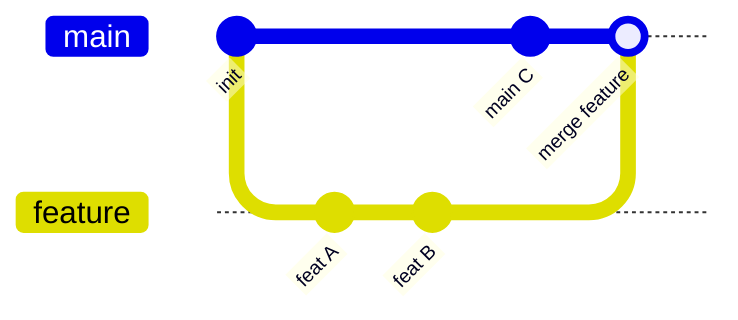
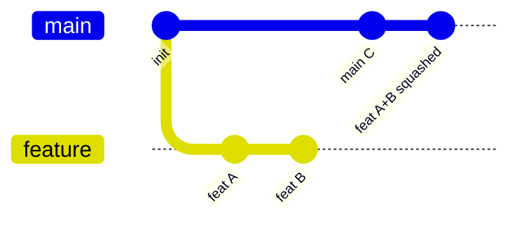
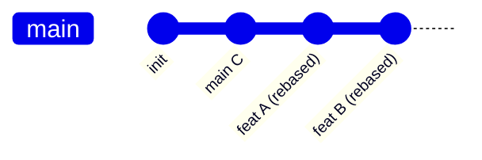
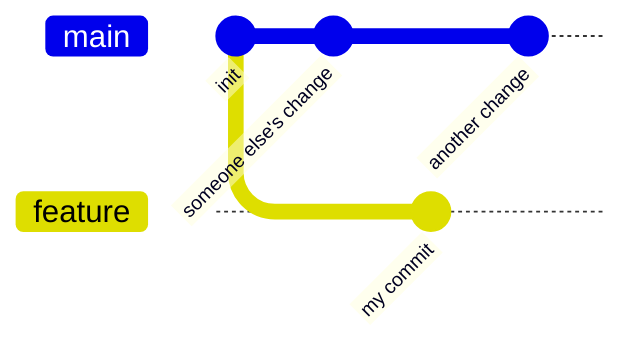
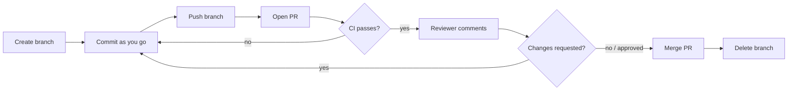

# Git Merging, Commit Hygiene & Pull Requests

> The messier parts of `git`: which merge strategy to pick, how to clean up commits before opening a PR, how to resolve conflicts, and how to undo things without breaking shared history. Builds on [`branching-and-commits.md`](branching-and-commits.md) — that file covers naming, this one covers the flow.

## 1. Merge strategies · Beginner

Three ways `git merge`/a PR "Merge" button can combine a branch into `main`. Same starting point, different resulting history.

**Merge commit** (`git merge feature`, or GitHub's default "Create a merge commit") — keeps every commit from the branch, plus one new merge commit tying them together.



**Squash merge** (GitHub's "Squash and merge") — all of the branch's commits become a single new commit on `main`. The branch's individual commit history is discarded (still visible on the closed PR, just not in `main`'s log).



**Rebase merge** (GitHub's "Rebase and merge") — the branch's commits are replayed one-by-one on top of `main`, no merge commit at all. History stays linear.



| Strategy | `main` history | Good when |
| --- | --- | --- |
| Merge commit | Every commit + a merge commit | You want to preserve exactly what happened, including mid-branch commits (large/long-lived branches, release branches) |
| Squash merge | One commit per PR | Most feature branches — messy WIP commits ("fix typo", "wip", "actually fix it") collapse into one clean commit |
| Rebase merge | Every commit, no merge commit, linear | You already keep commits clean and want a straight-line log (needs discipline per-commit) |

**Default recommendation for this repo's flow:** squash merge for `feature/` → `release/*` PRs. It matches the one-commit-per-PR habit and keeps `git log` on the release branch readable without needing every intermediate WIP commit.

## 2. Keeping your branch up to date · Intermediate

While your PR is open, `main` (or the release branch) keeps moving. Two ways to catch up:

```bash
# merge: pulls the latest target branch into yours, creates a merge commit
git checkout feature/vpc-module
git merge release/2026.08

# rebase: replays your commits on top of the latest target branch, no merge commit
git checkout feature/vpc-module
git rebase release/2026.08
```



Rebase gives a cleaner line but **rewrites your branch's commit hashes** — never rebase a branch someone else is also pushing to (or already opened review comments against specific commits on) unless you've agreed on it. Merge is always safe on a branch you don't own alone.

## 3. Resolving merge conflicts · Intermediate

```bash
git checkout feature/vpc-module
git merge release/2026.08
# CONFLICT (content): Merge conflict in main.tf

# 1. open the file — git marks the conflicting sections:
#    <<<<<<< HEAD
#    your version
#    =======
#    incoming version
#    >>>>>>> release/2026.08

# 2. edit the file to the version you actually want, delete the markers

# 3. mark it resolved and continue
git add main.tf
git commit          # for a merge conflict — finishes the merge commit
# or, if you were mid-rebase:
git rebase --continue

# bail out entirely and go back to before the merge/rebase started
git merge --abort
git rebase --abort
```

`git status` mid-conflict always tells you exactly which files still need resolving — run it after every `git add` if you're unsure what's left.

## 4. Fixing commits without rewriting shared history · Beginner

```bash
# forgot a file / made a typo in the LAST commit, and haven't pushed yet
git add forgotten-file.tf
git commit --amend --no-edit      # keeps the same message
git commit --amend                # opens editor to change the message too

# already pushed? amending rewrites the hash — only do this on YOUR
# feature branch that nobody else has pulled, then force-push:
git push --force-with-lease origin feature/vpc-module
```

`--force-with-lease` (not plain `--force`) refuses the push if someone else pushed to the branch since you last fetched — it protects you from clobbering a teammate's work you don't know about yet.

## 5. Cleaning commit history before a PR · Expert

```bash
# squash your last 3 "wip" commits into one, reorder, or reword —
# before you open the PR (or before merge, if you prefer rebase merges over squash)
git rebase -i HEAD~3
```

```text
pick a1b2c3d feat(vpc): add subnet scaffold
squash e4f5g6h wip
squash h7i8j9k actually fix the cidr math

# git opens an editor with lines like the above — change `pick` to:
#   squash (or s) — combine into the previous commit
#   reword (or r) — keep the commit, edit its message
#   drop   (or d) — remove the commit entirely
#   fixup  (or f) — like squash, but discards this commit's message
```

Only rewrite history that's still local to you, or on a branch you're certain nobody else has based work on — same rule as `--amend`. If squash-merge is your PR merge strategy (section 1), you often don't need this at all — GitHub does the squashing for you at merge time. Reach for interactive rebase when you want the *individual* commits on the branch to read cleanly too (e.g. for a rebase-merge workflow, or because reviewers read commit-by-commit).

## 6. Pull request workflow end to end · Intermediate



```bash
# 1-3: branch, commit, push (see branching-and-commits.md for naming)
git checkout -b feature/vpc-module
git commit -m "feat(vpc): add private subnets"
git push -u origin feature/vpc-module

# 4: open the PR (gh CLI, or the GitHub UI)
gh pr create --title "feat(vpc): add private subnets" --base release/2026.08

# 6-7: address review feedback as new commits during review — don't force-push
# mid-review, it makes diffs hard for the reviewer to re-check
git commit -m "fix(vpc): address review comment on subnet cidr"
git push

# once approved: squash-merge via the GitHub UI or:
gh pr merge --squash --delete-branch
```

**Reviewing** (the other side of the PR): `gh pr checkout <number>` pulls a teammate's PR branch locally so you can run it, not just read the diff.

## 7. Undoing things cleanly · Expert

```bash
# revert: adds a NEW commit that undoes an old one — safe on shared/pushed history
git revert <commit-sha>

# reset: moves the branch pointer — only safe on commits nobody else has pulled
git reset --soft  HEAD~1   # undo the commit, keep changes staged
git reset --mixed HEAD~1   # undo the commit, keep changes unstaged (default)
git reset --hard  HEAD~1   # undo the commit AND discard the changes — destructive
```

| Situation | Use |
| --- | --- |
| Undo a commit already on `main`/a shared branch | `git revert` — never `reset` on shared history |
| Undo your last local, unpushed commit, keep the edits | `git reset --soft HEAD~1` |
| Throw away your last local commit entirely | `git reset --hard HEAD~1` (only if you're sure — it's unrecoverable via normal means) |
| Undo a merge commit | `git revert -m 1 <merge-sha>` (the `-m 1` picks which parent is "the history to keep") |

## 8. Cherry-pick & stash · Expert

```bash
# cherry-pick: apply one specific commit from another branch onto yours
git cherry-pick <commit-sha>

# stash: shelve uncommitted changes to switch branches, then bring them back
git stash push -m "wip vpc module"
git checkout main
# ... do something urgent ...
git checkout feature/vpc-module
git stash pop
```

Cherry-pick is the tool for "I need just that one fix commit from `release/2026.07` on my current branch, not the whole branch." Stash is for "I need to switch branches right now but I'm not ready to commit this."

## Quick reference

| Need | Use |
| --- | --- |
| One clean commit per PR on `main` | Squash merge |
| Preserve every commit + explicit merge point | Merge commit |
| Linear history, no merge commits | Rebase merge |
| Catch your branch up with `main` (safe, shared branch) | `git merge <target>` |
| Catch your branch up with `main` (clean, solo branch) | `git rebase <target>` |
| Fix your last unpushed commit | `git commit --amend` |
| Clean up several local commits before a PR | `git rebase -i HEAD~N` |
| Force-push safely after amend/rebase | `git push --force-with-lease` |
| Undo a commit already shared with others | `git revert <sha>` |
| Undo your own unpushed commit | `git reset --soft/--hard HEAD~1` |
| Grab one commit from another branch | `git cherry-pick <sha>` |
| Shelve uncommitted work temporarily | `git stash push` / `git stash pop` |

## Practice safely

Try the destructive commands (`reset --hard`, `rebase -i`, force-push) in a throwaway repo first, not a real project:

```bash
mkdir /tmp/git-practice && cd /tmp/git-practice
git init
echo "a" > file.txt && git add . && git commit -m "commit 1"
echo "b" >> file.txt && git add . && git commit -m "commit 2"
echo "c" >> file.txt && git add . && git commit -m "commit 3"
# now try: git rebase -i HEAD~3, git reset --hard HEAD~1, etc.
```
